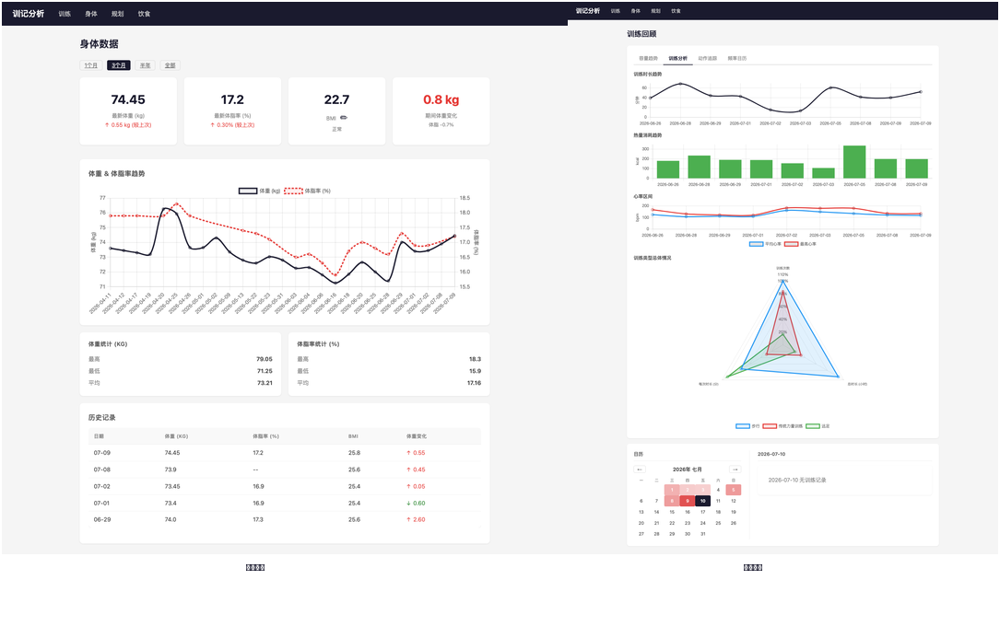

<p align="center">
  
</p>

<p align="center">
  <a href="LICENSE"></a>
  <a href="https://www.python.org/"></a>
  <a href="https://github.com/Ross98/XunJi/releases/tag/v1.0"></a>
</p>

# 寻迹 · 训记数据分析面板

基于 [训记](https://xunjiapp.cn) Open API 的个人健身数据仪表盘，提供训练记录、饮食分析、身体数据追踪和训练计划生成。

## 功能

- **仪表盘** — 总览近况：训练摘要、体重趋势、饮食热量统计
- **训练记录** — 按日/周/月/年查看训练详情、动作组数、容量、心率、热量、训练时长
- **训练日历** — 日历视图快速导航训练日期
- **饮食追踪** — 三餐记录、热量/营养素汇总，支持增删改
- **身体数据** — 体重、体脂、BMI 曲线，阶段变化统计
- **训练计划** — 根据近期训练历史自动生成建议计划
- **分析报告** — 训练频率、动作历史、容量/时长/心率/热量趋势、训练类型分布

## 快速开始

### 1. 配置 API Key

从训记 App → 设置 → Open API 获取密钥，创建 `.env`：

```bash
cp .env.example .env   # 或手动创建
```

填入以下环境变量：

| 变量 | 说明 |
| --- | --- |
| `XUNJI_API_KEY` | 训练数据 API Key |
| `XUNJI_FOOD_API_KEY` | 饮食数据 API Key |
| `XUNJI_FOOD_SEARCH_API_KEY` | 食物搜索 API Key |
| `XUNJI_BODY_API_KEY` | 身体数据 API Key |

### 2. 本地运行

```bash
pip install -r requirements.txt
uvicorn app:app --reload
```

打开 http://localhost:8000

### 3. Docker

```bash
docker build -t xunji .
docker run -p 8000:8000 --env-file .env xunji
```

## 项目结构

```
├── app.py              # FastAPI 入口
├── app_state.py        # 全局状态（Config、Cache、DataService）
├── config.py           # 配置（环境变量 → 数据类）
├── api_client.py       # 训记 API HTTP 客户端
├── cache.py            # SQLite 缓存层
├── data_service.py     # 数据服务（缓存+API 读写）
├── analysis.py         # 数据分析函数（趋势、统计、报告）
├── movements_cn.py     # 训练类型/动作中英文映射
├── planner.py          # 训练计划生成器
├── routes/             # 路由模块
│   ├── dashboard.py    # 仪表盘
│   ├── training.py     # 训练记录（日历/详情/分析）
│   ├── diet.py         # 饮食追踪
│   ├── body.py         # 身体数据
│   └── plan.py         # 训练计划
├── templates/          # Jinja2 模板
├── static/             # 静态资源
│   └── img/            # 项目图片
├── tests/              # 单元测试（pytest）
└── Dockerfile
```

## 技术栈

- **后端** — Python 3.11+, FastAPI, uvicorn
- **模板** — Jinja2, HTML
- **数据** — SQLite（缓存）, httpx（API 调用）, pandas（分析）
- **测试** — pytest
- **部署** — Docker

## 数据缓存

API 数据缓存在本地 SQLite 文件 `xunji_cache.sqlite` 中，避免重复请求。缓存自动按 key 过期；删除该文件可清空全部缓存。

## 资料

- [训记官方动作中文名表](./docs/Xunji-movements.md) — 标准动作名及回写规范
- [训记 App](https://xunjiapp.cn) — iOS/Android
